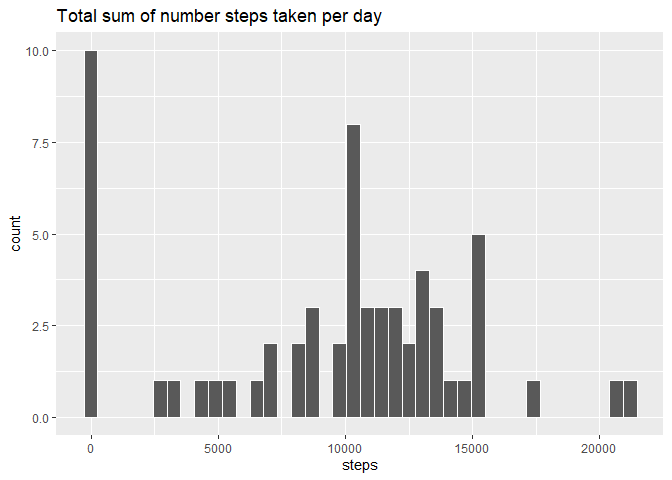
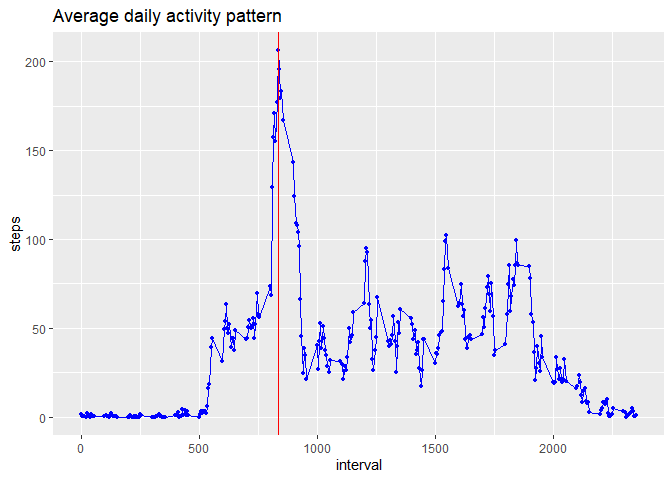
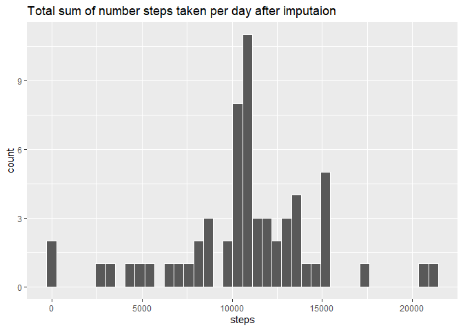
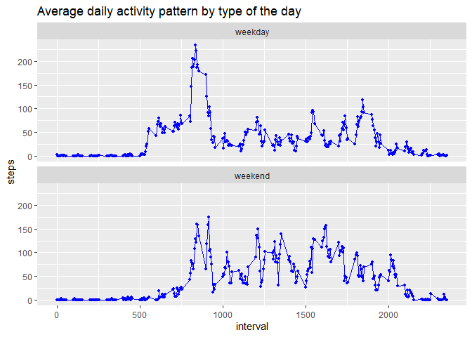

## Loading and preprocessing the data

```r
#Downloading the data
url <- "https://d396qusza40orc.cloudfront.net/repdata%2Fdata%2Factivity.zip"
path <- getwd()
download.file(url, file.path(path, "dataFiles.zip"))
unzip(zipfile = "dataFiles.zip")

#Activating packages
library(dplyr)
library(ggplot2)

#Changing system locale to English - as my OS is Russian, this is neccessary to make sure the part of code that checks for weekdays does it right
Sys.setlocale("LC_ALL","English")

#Some prepocessing for the future
database <- read.csv(paste0(path,"/activity.csv"),stringsAsFactors=F) %>% 
    mutate(date=as.Date(date,"%Y-%m-%d")) %>% 
    mutate(weekday=ifelse(weekdays(date) %in% c("Saturday","Sunday"),"weekend","weekday"))
```


## What is mean total number of steps taken per day?

```r
daysum_base <- database %>% 
    group_by(date) %>% 
    summarise(steps=sum(steps,na.rm=T)) %>% 
    ungroup() %>% 
    filter(!is.nan(steps))

ggplot(daysum_base,aes(x=steps))+
    geom_histogram(bins=40,color="white")+
    ggtitle("Total sum of number steps taken per day")  
```

<!-- -->

**Mean** of the total number of steps taken per day = 9354.23  
**Median** of the total number of steps taken per day = 10395

## What is the average daily activity pattern?

```r
intervalmean_base <- database %>% 
    group_by(interval) %>% 
    summarise(steps=mean(steps,na.rm=T)) %>% 
    ungroup()

ggplot(intervalmean_base,aes(x=interval,y=steps))+
    geom_path(color="blue")+
    geom_point(color="blue",size=1)+
    geom_vline(xintercept=intervalmean_base$interval[which.max(intervalmean_base$steps)],color="red")+
    ggtitle("Average daily activity pattern")
```

<!-- -->

On average across all the days in the dataset, the maximum number of steps happens at 835 interval

## Imputing missing values

```r
sum(is.na(database))
```
Total number of rows with missing values is 2304

As we've seen on a previous plot, activity patterns vary a lot by interval, so let's impute the missing values with a mean of relevant interval for now.


```r
daysum_base2 <- database %>% 
    group_by(interval) %>% 
    mutate(steps=ifelse(is.na(steps),mean(steps,na.rm=T),steps)) %>% 
    ungroup() %>% 
    group_by(date) %>% 
    summarise(steps=sum(steps)) %>% 
    ungroup() %>% 
    filter(!is.nan(steps))

ggplot(daysum_base2,aes(x=steps))+
    geom_histogram(bins=40,color="white")+
    ggtitle("Total sum of number steps taken per day after imputaion") 
```

<!-- -->

**Mean** of the total number of steps taken per day after imputation = 10766.19  
**Median** of the total number of steps taken per day imputation = 10766.19

While median only changed a bit, the mean has grown significantly after the imputation. Moreover, the are now equal. The main reason for this change is seen in the histogram - most close to 0 have gone, and the new peak is to the right of 1000 steps


## Are there differences in activity patterns between weekdays and weekends?

```r
weekday_base <- database %>% 
    group_by(interval,weekday) %>% 
    summarise(steps=mean(steps,na.rm=T)) %>% 
    ungroup()

ggplot(weekday_base,aes(x=interval,y=steps))+
    geom_path(color="blue")+
    geom_point(color="blue",size=1)+
    facet_wrap(~weekday,nrow=2)+
    ggtitle("Average daily activity pattern by type of the day")
```

<!-- -->

On average, activity on weekdays starts earlier and has a high peak at intervals 800-850. On weekends activity tends to start later and is more spread out through the day.
